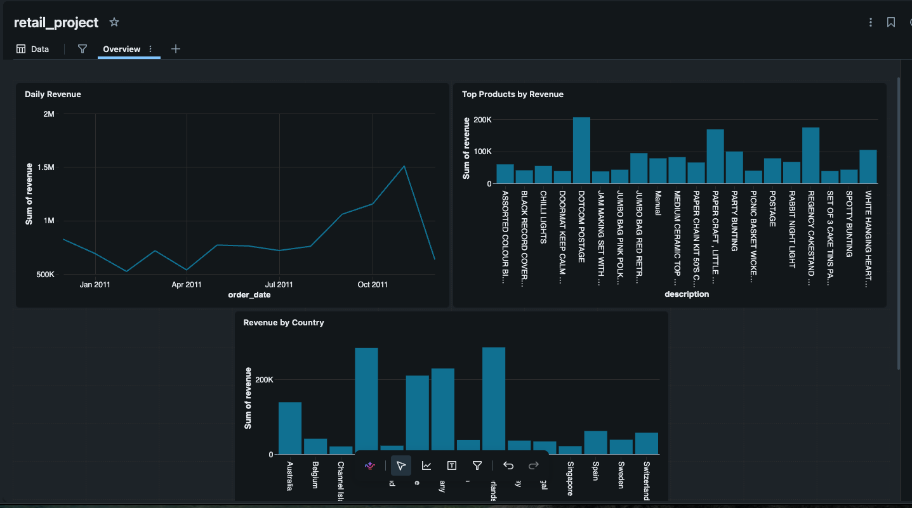
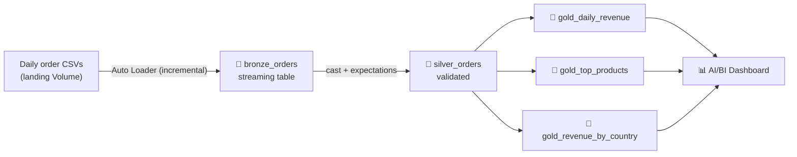
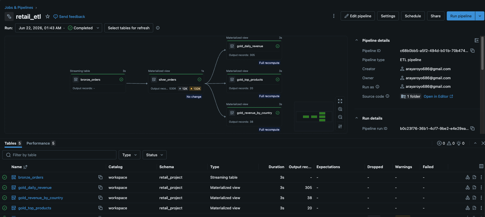

# 🛒 Automated Daily Sales Pipeline — Databricks Lakeflow

A data engineering project that **automates a manual daily reporting task**. At a fictional
online retailer ("NorthPeak Retail"), an analyst spent an hour every morning downloading
the previous day's order export, cleaning bad rows by hand, and refreshing a sales report.
This pipeline replaces that entire process with an automated, orchestrated, quality-checked
**Lakeflow Spark Declarative Pipeline** on Databricks.

> **The ticket:** *"Automate the daily ingestion of order files and the sales report. Make it run on its own."*



---

## 🏗️ Architecture



The three Gold tables depend on Silver, which depends on Bronze. The declarative engine
**infers this dependency graph automatically** and orchestrates execution order — no manual
wiring of tasks.



---

## 🧰 Tech stack

| Concern        | Technology                                              |
|----------------|---------------------------------------------------------|
| Platform       | Databricks (Free Edition, serverless)                   |
| Ingestion      | Auto Loader (`cloudFiles`) — incremental, exactly-once  |
| ETL framework  | Lakeflow Spark Declarative Pipelines                    |
| Data quality   | Pipeline expectations                                   |
| Storage        | Delta Lake on Unity Catalog (Volumes + tables)          |
| Serving        | Databricks AI/BI Dashboards                             |
| Scheduling     | Scheduled pipeline (daily)                              |

---

## 🔄 Pipeline layers

### 🥉 Bronze — `bronze_orders`
A streaming table fed by **Auto Loader**, which incrementally ingests new daily CSVs from a
Unity Catalog **Volume** (the landing zone). Auto Loader tracks processed files in a
checkpoint, so each run handles only new files — never reprocessing old ones.
*Result: 542K raw rows.*

### 🥈 Silver — `silver_orders`
Casts types, computes `revenue = quantity * unit_price`, and enforces **data-quality
expectations**:
- `expect_or_drop` on null keys and non-positive quantity/price (removes cancellations,
  returns, and broken rows).
- `expect` (warn, but keep) on missing `customer_id` — still valid revenue.

*Result: 530K clean rows. 12K rows dropped by quality rules; 132K rows flagged as missing a
customer ID (~25%, a known characteristic of this dataset) but retained.*


### 🥇 Gold — metric tables
Materialized views, business-ready:
- `gold_daily_revenue` — revenue, orders, and units per day (**this is the automated
  replacement for the manual daily report** — 305 days).
- `gold_top_products` — top 20 products by revenue.
- `gold_revenue_by_country` — revenue and orders per country (38 countries).

---

## 📊 Dashboard

Built in Databricks AI/BI on the Gold tables:
- **Daily Revenue** — line chart of the sales trend over time.
- **Top Products by Revenue** — bar chart of best sellers.
- **Revenue by Country** — bar chart by market.

---

## 🧠 Engineering decisions worth noting

- **Declarative over imperative**: tables are *declared*; the engine handles execution
  order, incrementalization, checkpointing, and retries — far less code than manual Spark.
- **Quality is measured, not assumed**: expectations quantify exactly how many rows are
  dropped vs. flagged on every run, instead of silently filtering.
- **Incremental ingestion**: Auto Loader processes only new files (exactly-once), so the
  pipeline scales to daily arrivals without reprocessing history.
- **Intentional handling of returns**: cancellations (negative quantity) are excluded from
  the sales layer rather than silently summed into revenue.

---

## 🧩 A challenge I hit (and fixed)

The dataset library (`ucimlrepo`) split the table so that `data.features` only exposed 5 of
the 8 columns — `InvoiceNo`, `StockCode`, and `Description` were missing. The pipeline caught
it immediately with an `UNRESOLVED_COLUMN` error. Fix: rebuild the landing files from
`data.original` (the full table) and run a **full refresh** to reset Auto Loader's checkpoint
and re-ingest with the complete schema. A good reminder to validate source schemas early.

---

## ▶️ How to reproduce

1. Sign up for **Databricks Free Edition**.
2. Run `phase1_setup_landing.py` to create the landing Volume and generate the daily CSVs.
3. Create a Lakeflow **ETL Pipeline**; add the transformation files from `/transformations`
   (`bronze_orders.py`, `silver_orders.py`, `gold_metrics.py`).
4. Run the pipeline, then **Schedule** it to run daily.
5. Build the dashboard on top of the `gold_*` tables.

---

## 📁 Repo structure

```
.
├── README.md
├── notebooks/
│   └── phase1_setup_landing.py
├── transformations/
│   ├── bronze_orders.py
│   ├── silver_orders.py
│   └── gold_metrics.py
└── docs/
    ├── dashboard_revenue.png
    ├── pipeline_graph.png
    └── Retail_expectations.png
```

---

*Data source: Online Retail dataset, UCI Machine Learning Repository (CC BY 4.0).*
